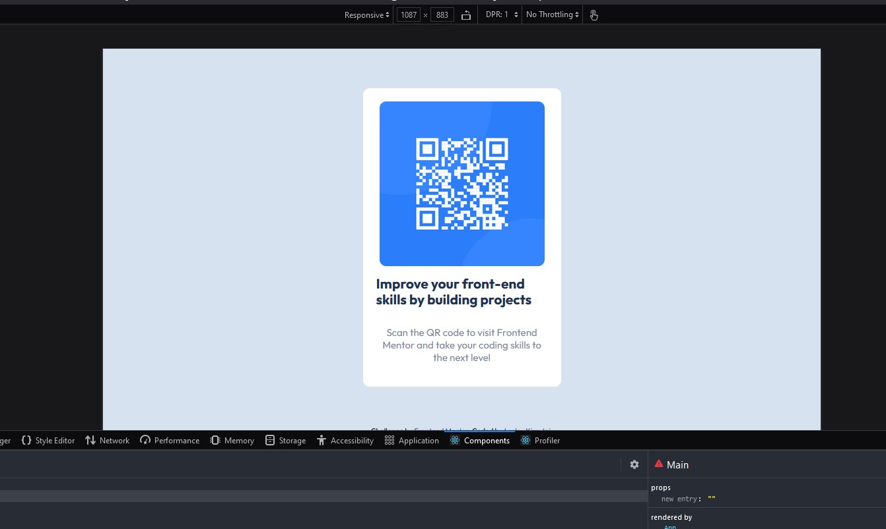

# Frontend Mentor - QR code component solution

This is a solution to the [QR code component challenge on Frontend Mentor](https://www.frontendmentor.io/challenges/qr-code-component-iux_sIO_H). Frontend Mentor challenges help you improve your coding skills by building realistic projects.

## Table of contents

- [Overview](#overview)
  - [Screenshot](#screenshot)
  - [Links](#links)
- [My process](#my-process)
  - [Built with](#built-with)
  - [Continued development](#continued-development)
- [Author](#author)
- [Acknowledgments](#acknowledgments)

## Overview

Practising React so built it using create-react-app

### Screenshot

- Screenshot of the QR Code site

### Links

- Solution URL: [GitHub URL => ](https://github.com/issagoodlifeInc/qr-code.git)
- Live Site URL: [Netlify Site => ](https://qrcode-les.netlify.app/)

## My process

- First `create-react-app` then set the files to use `Main` and `Footer` section (could have just used one)
- Worked on the markup of the `main` section
- Styled the markup
- Done ....n .... deployed

### Built with

- Semantic HTML5 markup
- CSS custom properties
- Flexbox
- [React](https://reactjs.org/) - JS library

### Continued development

- Better turnaround time
-

## Author

- Website - [Lesley Kimutai](https://linktr.ee/les_kim)
- Frontend Mentor - [@leskim](https://www.frontendmentor.io/profile/Leskim)
- Instagram - [@lesley](https://www.instagram.com/lesleykimutai/)
